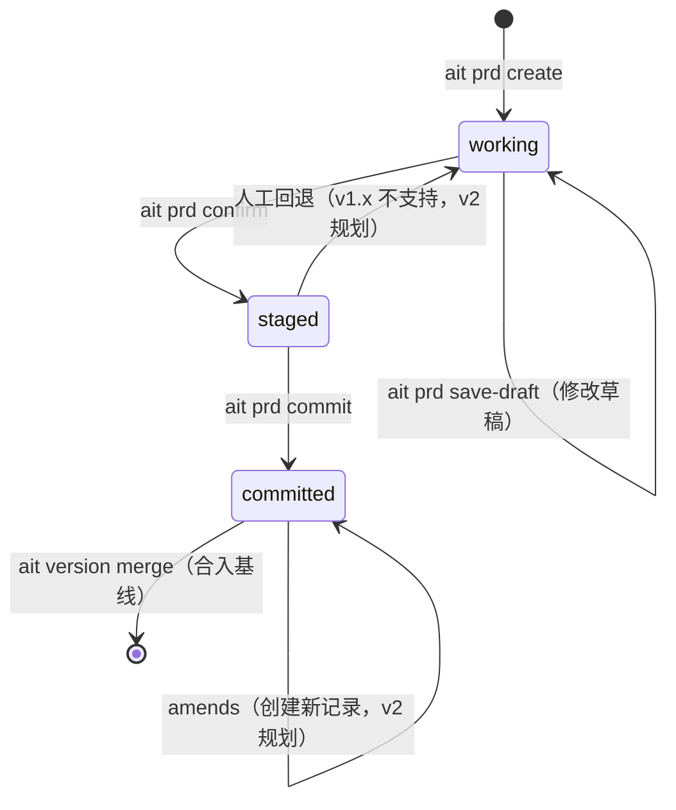
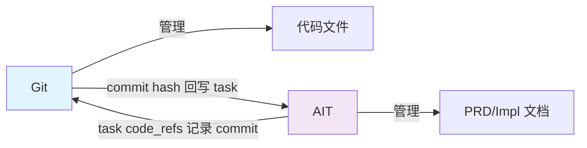

# AIT 设计文档

> AI-Assisted Document Versioning — 面向 AI 协作的文档版本控制系统

## 目录

- [1. 项目概述](#1-项目概述)
- [2. 设计理念](#2-设计理念)
- [3. 解决的核心问题](#3-解决的核心问题)
- [4. 核心架构设计](#4-核心架构设计)
- [5. 关键技术决策](#5-关键技术决策)
- [6. 适用场景](#6-适用场景)
- [7. Redesign：prd-impl-task 流水线](#7-redesignprd-impl-task-流水线)

---

## 1. 项目概述

**AIT（AI-Assisted Document Versioning）** 是一个为 AI 协作文档提供块级版本控制能力的系统。它将 Markdown 文档中的 `<!-- @id:xxx -->` 块（Chunk）作为版本控制的最小单元，提供了类似 Git 的三阶段提交工作流，但操作对象是语义化的文档块而非文件行。

在此基础上，redesign（已实现并自举验证）补齐了 `PRD → impl → task → code` 的完整 AI 开发流水线：把锁定的 PRD+impl 拆分为可执行的 task YAML 喂给 AI 编码，并通过 `version confirm` 把成果原子地合入基线。详见 [第 7 章](#7-redesignprd-impl-task-流水线)。

### 核心定位

> AIT 是文档侧的 Git 补充：Git 管理代码文件，AIT 管理 PRD/Impl 文档的语义块，并把这些块驱动成 AI 编码任务。

### 项目状态

| 项目信息 | 详情 |
|---------|------|
| 当前版本 | 截至 v1.5（在 v1.4 自举验证后，v1.5 补齐了 task 同位迁移、init 增量化、skill/CLI 双轨入口、sub-skills 覆盖与治理） |
| 运行形态 | Claude Code Skill（可扩展到其他 AI IDE） |
| 技术栈 | Python 3.10+ / PyYAML / Pydantic / Click CLI |
| 触发方式 | `/ait <subcommand>`（底层调 `project-docs/.ait/ait-cli`） |
| 命令组 | `init` / `prd` / `impl` / `task` / `version` / 查询类（`specgraph`/`deps`/`impact`/`context`/`search`/`state`/`reindex`） |

> **术语对齐**：旧文档中"V1.3 规划"的代码生成、回滚等能力，在 redesign 中已落地或被更简洁的设计替代。本文档涉及旧 V1.x 边界处均已标注更新。

---

## 2. 设计理念

### 2.1 设计原则

AIT 的设计遵循以下核心原则：

#### ① 内容与元数据分离

```
Markdown 文件  →  内容 + @id/@ref 标注（人类可读）
.meta/ 目录    →  YAML 索引 + 版本状态（机器可读）
```

- Markdown 只放内容 + `@id`/`@ref`，所有状态/版本信息在 `.meta/` 的 YAML 中
- 这种分离使得文档既可以被人类直接阅读，也可以被机器精确解析

#### ② 块级原子性

```
传统 Git：以"文件"为版本控制单元
AIT：     以"Chunk（@id 标注的块）"为版本控制单元
```

- 合并的最小单位是块，不做行级 diff
- 每个块有独立的生命周期（working → staged → committed）
- 块是语义单元，而非物理行

#### ③ AI 友好

- 所有命令的输出是结构化 JSON，便于 AI 消费
- 所有命令的设计避开"魔法"，让 AI 能准确预测系统行为
- 提供 `ait context <chunk-id>` 命令，为 AI 组装分层上下文（L1+L2）

#### ④ 跨 IDE 中立

```
核心 = 纯 CLI（Python）
  ↓
各 AI IDE 通过自己的 Skill/Rule 机制包装
  ↓
Claude Code / Cursor / Continue / Cline ...
```

- 核心是纯 CLI，不绑定特定 IDE
- 各 AI IDE 通过 Skill 机制提供用户体验

#### ⑤ 全程可追溯

- 每次 commit 产生 `chg-{id}.yaml` 变更记录
- 版本合并产生快照（`.meta/snapshots/`）
- 任何变更都能回到时间点

### 2.2 块（Chunk）哲学

AIT 对文档的基本认知是：**PRD/Impl 文档是语义块的树状结构，而非纯文本行**。

```markdown
<!-- @id:prd-book-recommend -->      ← 块的开始
## 图书推荐

基于借阅历史的图书推荐。

<!-- @ref:impl/api#impl-api-recommend rel:implements -->  ← 块间关联
                                      ← 块的结束（下一个 @id 或文件尾）
<!-- @id:prd-book-borrow -->
## 图书借阅
...
```

**关键设计决策**：

| 决策 | 理由 |
|------|------|
| 用 HTML 注释 `<!-- -->` 而非 YAML frontmatter | 注释不渲染，对文档可读性无影响 |
| `@id` 全局唯一 | 支持跨文件引用 |
| 块边界由 `@id` 界定，不依赖标题层级 | `##` 和 `###` 可以是同一父块下的兄弟 |
| `@ref` 声明块间关系 | 让"impl 实现 prd"成为一等公民 |

---

## 3. 解决的核心问题

### 3.1 问题一：Line-level diff 无法捕获意图

**传统 Git 的局限**：

```diff
- ## 用户登录
+ ## 用户认证
```

Git 看到的是文本变更，但 AI 协作中更重要的是**语义变更**——"登录"改为"认证"可能意味着整个安全模型的重构。

**AIT 的解决方案**：

- 每个语义块有唯一 `@id`
- 变更以块为单位记录（`action: modify` + `base_hash` 冲突检测）
- `ait version status` 显示的是"3 个块已修改"，而非"15 行变更"

### 3.2 问题二：跨文件关系对 AI 不可见

**场景**：

```
prd/book-management.md  ←── implements ──→  impl/api-contracts.md
     prd-book-recommend  ←── implements ──→  impl-api-recommend
```

当 AI 要基于 `prd-book-recommend` 生成实现时，它需要知道：
1. 这个目标 PRD 块
2. 相关的 impl 示例（L2 上下文）

**AIT 的解决方案**：

- `@ref:target#chunk-id rel:implements` 让关系成为一等公民
- **`specgraph.yaml`**（有向图谱）汇总所有跨块引用与依赖关系（redesign 中已**替代** `links-index.yaml`）
- `ait context prd-book-recommend --scenario prd-to-impl` 自动组装 L1（目标块）+ L2（关联 impl）
- `ait deps` / `ait impact` 基于 specgraph 做依赖与影响面分析

### 3.3 问题三：AI 需要结构化上下文，而非原始文件

**传统方式的问题**：

> AI：请基于这个 PRD 生成接口设计。
> 
> 人类：给你整个 `prd/book-management.md`（500 行）

AI 真正需要的是：
1. 目标 PRD 块的内容（L1）
2. 这个目标块关联的其他 impl 示例（L2）
3. 项目级的约束和规范（L3/L4，V2 规划）

**AIT 的解决方案**：

```
ait context prd-book-recommend --scenario prd-to-impl
```

返回：

```json
{
  "ok": true,
  "data": {
    "L1": {
      "chunk_id": "prd-book-recommend",
      "content": "## 图书推荐\n\n基于借阅历史推荐图书。\n..."
    },
    "L2": [
      {
        "chunk_id": "impl-api-recommend",
        "rel": "implements",
        "content": "## 推荐接口\n\nGET /api/v1/books/recommend..."
      }
    ]
  }
}
```

### 3.4 问题四：AI 协作产生的文档变更难以版本化

**AI 协作的特点**：

- 多轮讨论后才确定最终 PRD
- 讨论过程需要保留（为何这样决策）
- 从 PRD 到 Impl 的追溯链需要完整

**AIT 的解决方案**：三阶段提交

```
  working  ──stage──►  staged  ──commit──►  committed
    │                        │                    │
  AI 讨论草稿           人工确认              可合并到基线
  (可反复修改)          (可回退)             (不可修改，
                                              amends 创建新记录)
```

- `working`：AI 讨论产生的草稿，存在 `.meta/requirements/req-NNN.yaml`
- `staged`：人工确认后，写入版本工作区 `versions/{vX.Y}/prd/<file>.md`
- `committed`：版本内确认完成，可执行 `ait version merge` 合入基线 `docs/`

### 3.5 问题五：文档版本与代码版本脱节

> redesign 已落地：详见 [第 7 章](#7-redesignprd-impl-task-流水线)

**旧 V1.x 状态**：AIT 管理文档版本，代码版本由 Git 管理，两者无关联。

**redesign 的解决方案**：补齐 `PRD → impl → task → code` 链条中缺失的 **task** 一环：

- `ait task create` 把锁定的 PRD+impl 拆分为单 task YAML（AI 编码的最小上下文包）
- `ait task execute` 输出 token 聚焦的上下文驱动 AI 编码
- `ait task complete` 把产出的 **git commit hash + 文件路径** 回写到 task 的 `code_refs`，打通 doc↔code 追溯
- `ait version confirm` 时一并产生 git commit（message = 版本 title），文档版本与代码提交对齐

> AIT 不托管代码本体（那是 Git 的职责）；它只记录"哪个 task 由哪个 commit 实现"，保持职责清晰分离。

---

## 4. 核心架构设计

### 4.1 项目布局

```
<cwd>/                            ← 运行 ait 命令的目录
└── project-docs/                 ← AIT 管理的根目录（硬编码）
    ├── .ait/                     ← v1.5：init 生成的项目本地 wrapper
    │   └── ait-cli                 ← 项目侧统一入口，读 config.yaml#skill_path 跳到 skill
    ├── docs/                     ← 基线（baseline），所有版本合并后的真实状态
    │   ├── prd/                 ← 产品需求文档
    │   ├── impl/                ← 实现设计文档
    │   └── global/             ← 全局信息层（redesign，init 生成）
    │       ├── overview.md      ←   静态：项目概述（人工维护）
    │       ├── tech-stack.md    ←   静态：技术栈（人工维护）
    │       ├── ddl.md           ←   动态：由 impl @extract 提取
    │       ├── schema.md        ←   动态：由 impl @extract 提取
    │       └── api.md           ←   动态：由 impl @extract 提取
    ├── versions/{vX.Y}/         ← 每个版本的增量工作区
    │   ├── prd/
    │   ├── impl/
    │   ├── tasks/T-*.yaml         ← v1.5：AI 编码任务 YAML（从 .meta/tasks/ 迁移过来）
    │   └── state.md             ← 版本进度面板
    └── .meta/                   ← 机器可读的索引和元数据
        ├── config.yaml           ← 项目配置（initialized / skill_path）
        ├── chunks-index.yaml     ← 基线块台账（状态视角）
        ├── chunks-index-{vX.Y}.yaml  ← 版本块台账
        ├── specgraph.yaml        ← 基线关系图（关系视角，替代 links-index）
        ├── specgraph-{vX.Y}.yaml ← 每版本关系图（分文件，redesign）
        ├── versions/{vX.Y}.yaml     ← 版本定义（phase/锁定/title/tasks_summary）
        ├── requirements/req-NNN.yaml  ← PRD 讨论草稿
        ├── changes/chg-NNN.yaml      ← 变更记录
        └── snapshots/{vX.Y}/         ← 版本合并快照
```

> `links-index.yaml` 已废弃。所有块间关系统一由 specgraph 管理。`specgraph` 与 `chunks-index` 均采用"全局基线 + 每版本分文件"的惯例，使 `version reset` 退化为干净的删文件操作。
>
> **v1.5 调整**：task YAML 从 `.meta/tasks/{vX.Y}/` 迁移到 `versions/{vX.Y}/tasks/`，与所服务版本同位，让 `version reset` 只需删一个目录。`.meta/versions/{vX.Y}.yaml` 增加 `tasks_summary` 字段作为 task 状态汇总索引。项目本地 wrapper `project-docs/.ait/ait-cli` 在首次 init 后产生，是项目侧唯一 CLI 入口。

### 4.2 块（Chunk）生命周期



### 4.3 索引体系：两个视角

AIT 用两份索引从不同角度描述**同一批 chunk**：

| 索引 | 位置 | 视角 | 更新时机 | 用途 |
|---------|------|------|---------|------|
| chunks-index | `.meta/chunks-index.yaml` + `chunks-index-{vX.Y}.yaml` | 块**自身状态** | stage/commit/merge | state/action/commit_id 台账 |
| specgraph | `.meta/specgraph.yaml` + `specgraph-{vX.Y}.yaml` | 块**之间关系** | `impl create` / `reindex` / `version confirm` | implements/depends-on 有向图 |

- **chunks-index 回答**"这块到哪一步了？"——`version status`/`commit`/`merge` 消费它。
- **specgraph 回答**"这块跟谁有关？"——`task create`（反查 impl_refs）、`deps`/`impact`、`impl commit` 的 pre-merge 环检测消费它。
- URI 规范 `spec:<type>:<version>:<chunk-id>` 的 version 段区分 `baseline`（全局）与 `vX.Y`（版本工作区）。
- `links-index.yaml` 已废弃（仅 `implements` 一种关系、无版本维度、无图算法），其全部职责由 specgraph 接管。

**基线索引示例**：

```yaml
version: 1
scope: global
updated: 2026-05-26T21:00:00+08:00
chunks:
  - id: prd-book-recommend
    file: prd/book-management
    heading: "图书推荐"
    level: 2
```

**版本索引扩展字段**：

```yaml
version: v1.3
chunks:
  - id: prd-book-recommend
    file: prd/book-management
    heading: "图书推荐"
    level: 2
    action: modify                    # add/modify/delete
    state: committed                # working/staged/committed
    commit_id: chg-042             # 所属变更记录
    base_hash: abc123...           # 冲突检测哈希
    source_req: req-001            # 来源需求
```

### 4.4 命令体系

AIT 命令分为 6 组（redesign 后）：

#### 生命周期

| 命令 | 作用 |
|------|------|
| `ait init` | 三态自动识别：**fresh**（项目未纳管 → 全套生成）/ **incomplete**（global 文件或 wrapper 缺一部分 → 差异补全）/ **ready**（齐全 → no-op）。支持 `--check`、`--skip`、`--refresh-wrapper`。v1.5 废弃 `ALREADY_MANAGED` 强限制 |
| `ait reindex` | 重新扫描 `docs/` 并重建 chunks-index + 基线 specgraph |
| `ait state [--version v] [--save]` | 生成版本进度面板（title/phase/锁定/覆盖率/task 进度） |

#### PRD 管理

| 命令 | 作用 |
|------|------|
| `ait prd create <title>` | 创建需求；自动创建版本（如无活跃版本） |
| `ait prd save-draft <req-id> --content-file <path>` | 保存 AI 讨论的 PRD 草稿 |
| `ait prd resolve-candidates --from-file <yaml>` | 持久化 AI 生成的 PRD 候选决策到版本工作区 |
| `ait prd confirm <req-id> --file prd/<slug>` | 将草稿固化到版本工作区 |
| `ait prd show <prd-file> [chunk-id]` | 查看 PRD 文件大纲或单个块 |
| `ait prd commit <prd-file> -m <msg>` | 提交 PRD 块并**锁定 PRD**（本版本不可再改） |

#### Impl 管理

| 命令 | 作用 |
|------|------|
| `ait impl create <prd-chunk-id> --content-file <path>` | 添加 impl 块（自动注入 `@ref`；1 PRD chunk → N impl） |
| `ait impl show <impl-chunk-id>` | 查看单个 impl 块 |
| `ait impl commit <impl-chunk-id> -m <msg>` | 提交并锁定 impl；运行 **pre-merge 校验**（环 + 版本内重复） |
| `ait impl inherit <prd-chunk-id>` | 复制基线 impl 块到当前版本工作区（增量复用） |
| `ait impl lock [--version <v>]` | 锁定本版本 impl（推进 phase 到 `impl_locked`，允许开始拆 task） |

#### Task 管理（redesign）

| 命令 | 作用 |
|------|------|
| `ait task create [prd-chunk]` | 从 specgraph 派生 task YAML（impl_refs/global_refs/deps）；无参列待拆分 chunk |
| `ait task execute [task\|chunk]` | 标 executing + 输出 token 聚焦上下文（不写代码） |
| `ait task complete <id> [--commit h] [--path p]` | 标 done + 绑定 code_refs（自动收口，无 task confirm） |
| `ait task fail <id>` | 标 failed（可重跑） |
| `ait task list / show` | 查看 task |

#### 版本管理

| 命令 | 作用 |
|------|------|
| `ait version status <vX.Y>` | working/staged/committed 状态统计 |
| `ait version confirm <vX.Y>` | 原子：预检 → 合入基线 → 提取动态 global → git commit（redesign） |
| `ait version merge <vX.Y>` | 底层合并（confirm 内部调用） |
| `ait version reset <vX.Y> --confirm` | 整版重置（逃生口，物理删除工作区+索引+specgraph-{v}+tasks） |

#### 查询 / 图

| 命令 | 作用 |
|------|------|
| `ait deps <chunk-id>` | 出向依赖（implements/depends-on） |
| `ait impact <chunk-id>` | 反向影响面 |
| `ait specgraph sync` | 从 `docs/` + 版本工作区重建 specgraph |
| `ait specgraph add-edge <src> <dst> --rel <rel>` | 手动添加 specgraph 边 |
| `ait specgraph query <chunk-id> [--deps\|--implements]` | 关系图查询 |
| `ait specgraph export [--format dot]` | 导出图谱（Graphviz DOT） |
| `ait context <chunk-id> --scenario <type>` | 为 AI 组装结构化上下文 |
| `ait search <query>` | 搜索块内容 |

#### 校验 / 维护

| 命令 | 作用 |
|------|------|
| `ait lint [--scope ...] [--fix]` | PRD（四段结构）/ impl（`@ref` 完整性）格式校验；`--fix` 自动修复 |
| `ait baseline-summary [--scope ...] [--format ...]` | 基线块摘要（用于 prompt 预算评估） |
| `ait reindex` | 重建基线 `chunks-index.yaml` + `specgraph.yaml`；刷新各版本 `tasks_summary` |
| `ait migrate-block-to-chunk [--dry-run]` | v1.1→v1.2 一次性数据迁移（重命名 block→chunk） |

### 4.5 Skill 分层架构

AIT 采用 **主 Skill + 子 Skill** 的分层架构：

```
skill/ait/                          ← 主 Skill（Router 角色）
├── SKILL.md                        ← 路由表 + 全局契约 + 命令速查
├── bin/ait                         ← skill 级 CLI 入口（仅 init / refresh-wrapper 用）
├── ait/                            ← Python 核心包
│   ├── cli.py                      ← Click 命令定义
│   ├── chunk_parser.py             ← 块解析器
│   ├── index_manager.py            ← 索引管理
│   ├── version_manager.py          ← 三阶段提交 + confirm
│   ├── merge_engine.py             ← 合并引擎
│   ├── context_assembler.py        ← AI 上下文组装
│   ├── prd_manager.py             ← PRD 管理逻辑
│   ├── impl_manager.py             ← Impl 管理逻辑
│   ├── task_manager.py             ← task 派生 / execute / complete
│   ├── init_manager.py             ← v1.5 三态识别与差异补全
│   └── ...
├── references/                     ← 设计文档（供 AI 读取）
│   ├── chunk-system.md
│   ├── chunk-parser.md
│   ├── index-system.md
│   └── ...
└── sub-skills/                    ← 子 Skill 集合（v1.5 后治理完成）
    ├── ait-discuss/                ← PRD 三阶段讨论
    ├── ait-impl-discuss/           ← Impl 设计讨论
    ├── ait-state/                  ← 版本状态面板 + 进度查询（v1.5 合并了原 ait-progress 职责）
    ├── ait-resume/                 ← 失败恢复
    ├── ait-init-guide/             ← v1.5 init 进入 incomplete 模式时引导补全（原 ait-init-check，不再做新/旧项目判别，交由 CLI）
    └── ait-task-execute/           ← v1.5 新增：驱动 AI 从聚焦 context bundle 编码 → task complete/fail
```

**设计优势**：

1. **关注点分离**：主 Skill 负责路由，子 Skill 负责具体流程
2. **Prompt 高效**：AI 只加载当前阶段相关的子 Skill，不被无关流程稀释
3. **可扩展**：新增流程只需添加子 Skill，不影响现有逻辑

**v1.5 sub-skills 治理记录**：

- 新增 `ait-task-execute`——摆渡期 `task execute` 由主 skill 兼任造成职责发散，独立后与 `ait-discuss`/`ait-impl-discuss` 并列为"阶段驱动型"子 skill。
- 合并 `ait-progress` → `ait-state`——原两者都在读同一批状态文件但从不同角度呈现，合并后唯一职责是调用 `state` 生成面板并回答进度/覆盖/task 状态问题。
- 重命名 `ait-init-check` → `ait-init-guide`——v1.5 后"新/旧/已纳管"三态识别全部下沉到 CLI，子 skill 只需在 incomplete 模式下逐项引导补全。
- 触发关键词审计（`scripts/verify-subskill-triggers.sh`）作为回归闸，防止未来出现"子 skill 文档与主 skill 路由表不一致"。

---

## 5. 关键技术决策

### 5.1 为什么用 `@id:xxx` 而非 YAML frontmatter？

| 方案 | 优点 | 缺点 |
|------|------|------|
| YAML frontmatter | 结构清晰 | 破坏 Markdown 可读性；需要特殊解析 |
| **HTML 注释（采纳）** | 对渲染完全透明；人类可读；IDE 友好 | 需要自定义解析器 |

### 5.2 为什么块边界不依赖标题层级？

```markdown
<!-- @id:parent -->
## 父功能

### 子功能 A
<!-- @id:child-a -->
内容 A...

### 子功能 B
<!-- @id:child-b -->
内容 B...
```

如果依赖标题层级，`### 子功能 A` 会被视为 `## 父功能` 的子块。但 AIT 认为：
- 标题层级是**排版意图**，块边界是**语义意图**
- 两者可能不一致（如上例，`child-a` 和 `child-b` 可能是独立块）

### 5.3 为什么三阶段而非两阶段？

```
两阶段（working → committed）：
  ✗ 缺少"人工确认"环节
  ✗ AI 生成的草稿可能直接进入版本历史

三阶段（working → staged → committed）：
  ✓ working：AI 自由讨论，可反复修改
  ✓ staged：人工确认，最后一次检查机会
  ✓ committed：正式进入版本历史，不可篡改
```

### 5.4 为什么索引写入用 temp→rename 原子操作？

```python
# 伪代码
def atomic_write(path, data):
    tmp = path.with_suffix('.tmp')
    tmp.write_text(data)
    os.fsync(tmp.fileno())  # 确保写入磁盘
    tmp.rename(path)         # POSIX 保证 rename 是原子的
```

**理由**：如果写入中断（断电、进程被杀），`.yaml` 文件可能半残。temp→rename 保证要么完整写入，要么完全没写入。

### 5.5 为什么 `project-docs/` 硬编码而非可配置？

**决策**：`project-docs/` 名称硬编码，无 `--project` 标志，无环境变量覆盖。

**理由**：
1. **减少 AI 出错**：硬编码减少"选错目录"的概率
2. **约定优于配置**：用户只需记住一个规则
3. **防止目录扩散**：如果可配置，项目内可能出现多个 AIT 根目录

---

## 6. 适用场景

### 6.1 推荐使用场景

| 场景 | 如何使用 AIT |
|------|--------------|
| **AI 协作编写 PRD** | `/ait prd "功能标题"` 启动三阶段讨论 → 生成结构化 PRD 块 |
| **PRD → Impl 追溯** | `ait context prd-xxx --scenario prd-to-impl` 获取 L1+L2 上下文 |
| **AI 编码** | `ait task create` 拆分 → `ait task execute` 喂聚焦上下文给 AI → `ait task complete` 回写 code_refs |
| **版本化文档管理** | `ait version confirm v1.4` 原子合入基线 + 提取动态 global + git commit |
| **影响面分析** | 修改块后，`ait impact <chunk>` / `ait deps <chunk>` 基于 specgraph 找出受影响块 |
| **进度跟踪** | `ait state` 或 `ait version status` 查看版本完成度与 task 进度 |
| **反悔重来** | `ait version reset <v> --confirm` 整版重置 |

### 6.2 设计边界

- ✅ **代码编码**：通过 task 驱动 AI 编码（execute 输出聚焦上下文，Skill 层驱动 AI；CLI 不直接生成业务代码）
- ✅ **doc↔code 追溯**：task 的 code_refs 记录 git commit + 文件路径
- ❌ **不托管代码本体**：代码版本仍由 Git 管理，AIT 只记录引用
- ❌ **多人协作**：当前为单用户串行版本模型（同一时刻只一个开发中版本）
- ❌ **反向同步**：代码变更 → 文档自动更新，暂不支持
- ❌ **非 Markdown 文档管理**

### 6.3 与其他工具的关系



- **AIT ≠ Git 替代品**：Git 管理代码，AIT 管理文档。
- **AIT + Git = 完整追溯**：redesign 中 task 的 `code_refs` 记录实现该任务的 git commit + 文件路径，`version confirm` 一并产生 git commit，文档与代码版本对齐。

---

## 7. Redesign：prd-impl-task 流水线

redesign 在原有"块级版本控制"地基上，补齐了一条完整的 AI 开发流水线。本章是它的设计深潜。

### 7.1 设计目标

| 目标 | 含义 |
|------|------|
| **目标1：链路打通** | `PRD → impl → task → code` 串成可追溯闭环，新增 task 一环 |
| **目标2：token 聚焦** | 任何阶段 AI 只聚焦对应 chunk/specGraph node，编码时只读单 task 的 impl_refs∪global_refs，不读全树 |
| **目标3：workflow 固化** | 设计完善的 skills 编排，支持新项目（`init` 讨论）和已有项目两个入口，对抗长程上下文劣化 |

### 7.2 核心地基：版本原子性

redesign 用一个决策消除了大量复杂度——**版本是原子单元，版本内不可变**：

```
prd commit / impl commit ──► 锁定（committed 后本版本不可改）
                                │
反悔唯一路径 ─────────────────► ait version reset <v> --confirm
                                （物理删除整版工作区，回到空白重来，不留快照）
```

**这个决策连带消掉了三个本会很重的子系统**：

- 无需"局部回滚/放弃"——版本内根本不允许局部变更
- 无需"checksum 失效检测"——committed 即冻结，不会静默漂移
- 无需"增量继承"——要变就整版重置

配合**严格串行单版本**（同一时刻只有一个开发中版本），"基线分叉冲突"也不可能发生，pre-merge 校验只需查两类问题（见 7.5）。

### 7.3 七阶段流水线

```
init → prd create/confirm/commit → impl create/commit → task create/execute/complete → version confirm
```

| 阶段 | 命令 | 产物 | 关键语义 |
|------|------|------|---------|
| 初始化 | `init` | `docs/global/*` | 仅全新项目；不占版本号 |
| PRD | `prd create→confirm→commit` | `versions/{v}/prd/*` + state.md | commit 锁定 PRD |
| impl | `impl create→commit` | `versions/{v}/impl/*` | 1 PRD chunk→N impl；commit 跑 pre-merge 校验并锁定 |
| task | `task create→execute→complete` | `.meta/tasks/{v}/T-*.yaml` | execute 输出聚焦上下文，complete 自动收口绑 code_refs |
| 合并 | `version confirm` | 基线 docs/ + 动态 global + git commit | 两阶段+回退 |

### 7.4 格式约定

#### PRD chunk —— 四段固定结构

```markdown
<!-- @id:prd-xxx -->
## 标题
### 概述          # 一句话价值
### 业务规则       # 拆 task 的依据
### 验收标准       # task 完成判定
### 边界与非目标    # 防 AI 过度发挥
```

#### impl chunk —— `@extract` 标记

impl 既是实现设计，又是**动态 global 的数据源**。用 `@extract` 标记可提取片段：

```markdown
<!-- @extract:dynamic/ddl#pet -->
```sql
CREATE TABLE pet (...);
```
<!-- @extract-end -->
```

`version confirm` 时按 `dynamic/{type}` 路由到 `docs/global/{type}.md`，写入 chunk 名 `{target}`。**动态 global 内容 100% 来自 impl @extract，禁止人工编辑**（防漂移）。

#### task YAML

```yaml
id: T-{源chunk}-NN          # 派生式命名，自带血缘
source_chunk: prd-xxx
impl_refs: [...]            # 查 specgraph（version 维度）的 implements 边
global_refs: [...]         # impl @ref 的 global + 默认 global-tech-stack
depends_on: [...]          # 拓扑序，由 impl 间 depends-on 边推导
order_hint: 1
steps: [...]
status: created            # created→executing→done/failed
code_refs: []              # done 时回写 {commit, paths, bound_at}
```

### 7.5 关键机制

#### ① 锁定 + pre-merge 校验（质量门左移）

`impl commit` 时把版本 specgraph 试合并进全局图（dry-run），检测两类问题，有问题拒绝 commit：

1. **依赖成环**（Kahn 拓扑排序检测）——否则 task 拆分无法排序
2. **版本内重复**——同 `@id` 多定义，或两个 impl 抢同一 `@extract` 目标

> 跨版本同名 `@extract` 目标是**合法演进**（后版本替换），不算冲突；判定键是"是否同一开发中版本"。

#### ② task execute 的职责边界

`task execute` **不写代码**。它把 task 标 `executing`，输出 token 聚焦的 context bundle（仅 impl_refs∪global_refs，不读全树），交 Skill 层驱动 AI。AI 写完后 `task complete`（标 done + 绑 code_refs）或 `task fail`。**没有 task confirm**——execute 成功即收口，人工审核统一到 `version confirm`。

#### ③ version confirm 的原子性（两阶段+回退）

```
阶段1 预检：所有 task done？git 干净？  ── 不满足则中止，不动文件
阶段2 merge：备份 docs/ → 合入基线 → 提取动态 global → 版本图并入全局图
阶段3 commit：git add+commit（msg=title）
       └─ 任何异常 → 回退 docs/ 到备份，报 MERGE_ROLLBACK
```

要么全成（docs 更新 + git commit），要么全不动。

### 7.6 设计自洽性

redesign 最强的地方在于**约束驱动的简洁**：

- 版本原子性 → 消掉局部回滚/失效检测/增量继承
- 严格串行 → 消掉基线分叉冲突
- specgraph 统一 → 废弃 links-index，关系查询单一数据源
- 去 task confirm → execute 自动收口，符合"coding 交 AI、人在 version confirm 把关"

> 一个决策消掉一个子系统，是好设计的标志。

---

## 附录：快速参考

### A. 块 ID 命名规范

```
{type}-{domain}-{name}
  │      │        │
  │      │        └─ 语义化短名（小写短横线）
  │      └─ 子域名（小写短横线）
  └─ 类型（prd / impl）
```

示例：`prd-book-recommend`、`impl-api-recommend`

### B. 关系类型

| 关系 | 方向 | 语义 |
|------|------|------|
| `implements` | impl → prd | impl 块实现某个 PRD 块 |
| `modifies` | impl → impl | impl 块修改/取代已有 impl 块 |
| `see-also` | 任意 → 任意 | 补充参考（无强依赖） |
| `refines` | impl → impl | 子块细化父块 |
| `depends-on` | impl → impl | 模块间依赖 |

### C. 错误码速查

| 错误码 | 含义 | 恢复方法 |
|--------|------|---------|
| `NOT_AT_PROJECT_ROOT` | CWD 无 `project-docs/` | 切换到项目根目录 |
| `CWD_INSIDE_PROJECT_DOCS` | CWD 在 `project-docs/` 内 | 退出到项目根目录 |
| `LOCKED` | 改已 commit 的 PRD/impl | 用 `version reset` 整版重来 |
| `PRD_NOT_COMMITTED` | impl 引用的 PRD 块未提交 | 先 `ait prd commit` |
| `PREMERGE_FAILED` | impl commit 检出环或版本内重复 | 修正 impl 设计后重新 commit |
| `PRD_NOT_LOCKED` / `NO_IMPL` | task create 前置不满足 | 先锁定 PRD / 先设计 impl |
| `BLOCKED` | task 依赖未 done | 先执行上游 task |
| `TASK_NOT_DONE` / `GIT_DIRTY` | version confirm 预检失败 | 跑完 task / 清理 git |
| `MERGE_ROLLBACK` | confirm 合并阶段失败 | docs/ 已回退，查错修复后重试 |
| `ENOENT_BIN_AIT`（虚拟，shell 报 `no such file or directory: bin/ait`） | 在项目根用相对路径 `bin/ait` | 改用 `project-docs/.ait/ait-cli`；若 wrapper 不存在，先跑 `~/.claude/skills/ait/bin/ait init --refresh-wrapper`。该码仅作文档 pitfall 标识，**不**在 `ait/schemas.py` 注册，也**不**进入 `ait-resume` 处理链路 |

---

> 本文档对应 AIT 截至 v1.5 的状态（`prd-impl-task` 三态流水线 + skill/CLI 双轨入口 + task 同位迁移 + init 增量化 + sub-skills 治理），具体实现以 `project-docs/docs/` 中的 PRD/Impl 文档为准。

---

## 附录 D：v1.5 治理记录

v1.5 是一个 **应用层治理型** 版本（不动核心设计、不动数据模型，专修外周摇摆项），包含四个正交的 chunk：

| Chunk | 主题 | 核心交付 |
|---|---|---|
| **prd-task-relocation** | task YAML 与服务版本同位 | `versions/<v>/tasks/T-*.yaml`；`.meta/versions/<v>.yaml#tasks_summary` 状态索引；legacy 路径告警；version reset 同步清理 |
| **prd-init-incremental** | init 从强限制改为差异补全 | CLI 三态识别（fresh / incomplete / ready）；`--check` / `--skip`；废弃 `ALREADY_MANAGED`；`ait-init-guide` 子 skill 重写 |
| **prd-skill-cli-resolution** | skill 入口 → 项目本地 wrapper 双轨制 | `project-docs/.ait/ait-cli` 生成与 `--refresh-wrapper`；`config.yaml#skill_path` 指向；70+ 处文档全局改写；`ENOENT_BIN_AIT` pitfall；`scripts/verify-wrapper-self-locate.sh` |
| **prd-subskills-coverage** | sub-skills 治理 | 新增 `ait-task-execute`；合并 `ait-progress` → `ait-state`；重命名 `ait-init-check` → `ait-init-guide`；触发关键词审计 `scripts/verify-subskill-triggers.sh` |

### 设计哲学上的几个选择

1. **CLI 可识别优于 skill 识别**。init 三态识别全部下沉到 CLI，子 skill 不再多维度估计项目状态——只需点头同意 CLI 返回的事实。上下文越短越准。
2. **薄壳 wrapper 代替环境变量**。不引入 `AIT_HOME` 这类环境变量绕路，而是让每个项目自带项目本地入口；代价是多了 `init --refresh-wrapper` 这个冷门子命令，收益是项目之间各自为政、CI 环境不依赖 PATH。
3. **task YAML 同位护航 `version reset` 原子性**。可使 `version reset` 从"跨多个目录零散删除"退化为单目录 rm，进一步制约"版本是原子单元"这个核心心智模型。
4. **sub-skills 职责不要重叠**。`ait-progress` 与 `ait-state` 读同一批状态文件的两种视角被判定为"一个概念不应两份文档"，合并后仅保留 `ait-state`。`ait-task-execute` 则是"摆渡期职责从主 skill 化出独立子 skill"的反向动作。

### 可验证质量

v1.5 增加三个回归脚本，作为后续演进的护栏：

- `scripts/verify-no-block-leak.sh`（历史）：防 `block` 术语回魂
- `scripts/verify-wrapper-self-locate.sh`（v1.5）：项目本地 wrapper 调起后能正确定位到 skill
- `scripts/verify-subskill-triggers.sh`（v1.5）：子 skill 文档与主 skill 路由表关键词一致

三条脚本被 `verify-all.sh` 包装，作为 v1.5+ 发布前的刚性检查。
