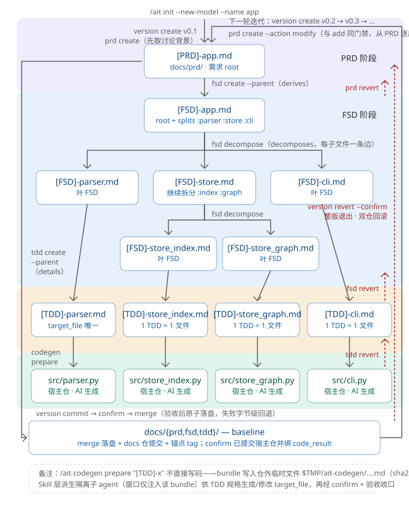

# AIT — Git-like Document Versioning for AI Coding

> A (in-development) Claude Code Skill built for **continuous iteration on large projects** and
> **multi-player AI-assisted development** — keeping AI-built projects maintainable over the long run.

**This is a Skill, not a CLI you call directly.** After installing, everything happens inside
Claude Code via slash commands: `/ait init`, `/ait prd create`, `/ait version merge`, …
There is no global `ait` binary on your PATH — see
[USER_GUIDE.md §1.2](USER_GUIDE.md#12-usage-ait-subcommand) for how routing works.

---

## Why

AI is already very good at building MVPs. But as a project iterates, it will sooner or later get
broken by the AI: the AI forgets a constraint established earlier, or changes one module while
forgetting its impact on the modules that depend on it.

A production-grade project under continuous iteration accumulates all kinds of special business
requirements and special implementation constraints. As this body of information grows, the model's
attention gets diluted by everything else in the project whenever it works on a specific problem.

This kind of knowledge should be **persisted within the project scope and continuously updated** —
not scattered across chat histories and personal memory. When the AI works on a problem, what it
needs is "everything relevant to this problem", not "everything about this project".

## How

When modifying something, the model should be given **only the context relevant to that change,
with everything else screened out** — spending the model's attention sweet spot entirely on the
problem at hand.

So AIT organizes development constraints (prompts) into a **structured document system**, and at
actual code-generation time extracts precisely the information relevant to the current task:

- **Chunk-level version control** (Git-like): documents are decomposed into semantic chunks
  annotated with `<!-- @id:xxx -->`, with a full version lifecycle of
  `/ait version create / commit / confirm / merge / revert`; merge lands atomically and rolls back
  byte-for-byte on failure.
- **Explicit relation graph (SpecGraph)**: derive/decompose/detail/dependency relations between
  chunks are explicit edges on a graph — never inferred from naming, never written into document
  bodies. When something changes, `/ait deps` / `/ait impact` answer "what does it depend on, and what
  does it affect".
- **Enforced invariants**: unique PRD↔FSD mapping, each TDD owning exactly one target file, no
  orphans, no broken links, full traceability without cycles — rejected at write time with zero
  disk writes, and re-validated globally before landing.
- **Focused context assembly**: `/ait codegen prepare` walks up the graph and packs only "this TDD's
  implementation blueprint + the upstream constraint chain + the interface contracts of its
  dependencies + the current state of the target file". No more, no less.

## The Three-Layer Document System

```
[PRD] Product Requirements ──derives──▶ [FSD] Functional Specs ──decomposes──▶ functional tree (recursive)
        what / why                       decomposition + capability contracts (black-box)
                                                │
                                         ──details──▶ [TDD] Tech Design
                                                single-file blueprint (white-box, 1 TDD ↔ 1 target_file)
```

| Layer | Answers | Contents |
|---|---|---|
| **PRD** (Product Requirements Doc) | what / why | User-perspective requirements, zero technical content; each requirement carries a user story + acceptance criteria |
| **FSD** (Functional Specifications Doc) | how to decompose | Functional decomposition + external capability contracts (only "what it provides", never implementation) |
| **TDD** (Tech Design Doc) | how to implement | Single-file implementation blueprint; each TDD maps to exactly one `target_file` |

At code-generation time, the AI receives not the whole document library but a context bundle
assembled along the relation graph — exactly enough to write this one file.

## The Full Pipeline at a Glance



Files as nodes, commands as edges: each layer's `create` lands its document, `codegen prepare`
connects a TDD to its code file, and `version commit → confirm → merge` atomically lands the
version workspace into the baseline. Red dashed lines are the rework paths; the right-hand loop
is continuous version iteration (v0.1 → v0.2 → …).

## Install

```bash
git clone <this-repo> && cd Ait
python install.py                      # install to ~/.claude/skills/ait
python install.py update               # upgrade (keeps .venv, fast)
python install.py update --skip-venv   # files only
python install.py uninstall
python install.py --prefix /custom/path
```

On first run, `bin/ait` creates a `.venv` inside the skill directory and installs its
dependencies — no manual setup needed.

## Usage

### The dummy's way

Just tell the AI:

> **"Learn AIT and develop following the AIT pattern."**

The AI will read the skill docs itself and organize development along the AIT pipeline
(prd → fsd → tdd → codegen).

### Manual mode

Follow [USER_GUIDE.md](USER_GUIDE.md)（[中文](USER_GUIDE.zh-CN.md)）step by step:
`/ait init` to bootstrap the project → `version create` to open a version → per-layer
`prd/fsd/tdd create + confirm` → `codegen prepare` for the focused context →
`version commit/confirm/merge` to land it.

## Q&A

**Q: How is this different from agent memory files like AGENTS.md / MEMORY.md?**

AGENTS.md is meant to be checked into the repo and shared by the whole team — directionally
the same as AIT. But it is a **flat prose file**: personal habits and long-term constraints
intermix, there is no fine-grained version lifecycle, no landing gate, and no way to answer
"which designs and which code does this constraint affect". AIT cuts constraints into
related chunks — with versions, acceptance, invariant gates, and a traceable chain to code.
MEMORY.md-style files lean toward personal/session memory and were never meant to carry
project-global constraints.

**Q: How is this different from skills like superpowers / gsd?**

superpowers is about **per-task execution discipline** (TDD, debugging, planning, review) —
"how to do it right this time". GSD is about **getting a project built**: spec-driven, with
cross-session structured artifacts (PROJECT/STATE/PLAN), wave-based parallelism and atomic
commits — fixing context rot in long sessions and AI editing code without permission.
AIT focuses on **continuous project iteration**: it builds PRD/FSD/TDD into an explicit
SpecGraph, uses context_assembler to trim context precisely (also fixing context rot in long
sessions) and impact to assess change blast radius. AIT can bind docs and code artifacts
together, and when AIT reverts it rolls back both docs and artifacts together.

**Q: What's the relationship with Git?**

Complementary. Git versions code in units of files and line-level diffs; AIT versions **the design
documents that drive AI coding** in units of semantic chunks, together with their relations. The
`project-docs/` directory AIT manages is its own git repository, and every merge records the
binding between doc version and code version (which code commit corresponds to which spec version).

**Q: When is AIT NOT a good fit?**

Building an MVP, a small feature, a one-off script — AIT is too heavy for that; just write it with
AI directly. AIT's value shows in **continuously developed, scaled projects**: many iterations,
accumulating constraints, multiple humans and AIs collaborating, changes in one place demanding
global awareness. The longer a project lives, the more AIT is worth.

---

## Status & Docs

AIT is built with AIT (dogfooding): `project-docs/` is its authoritative design source, and every
release goes through the full `/ait version create → prd → fsd → tdd → codegen → confirm → merge` loop.

| Doc | Contents |
|---|---|
| [USER_GUIDE.md](USER_GUIDE.md)（[中文](USER_GUIDE.zh-CN.md)） | Task-oriented walkthrough and troubleshooting |
| [DESIGN.md](DESIGN.md) | Architecture, design rationale, module map |
| [CHANGELOG.md](CHANGELOG.md) | Version history |
| [skill/ait/SKILL.md](skill/ait/SKILL.md) | Skill command contract |

MIT licensed.
