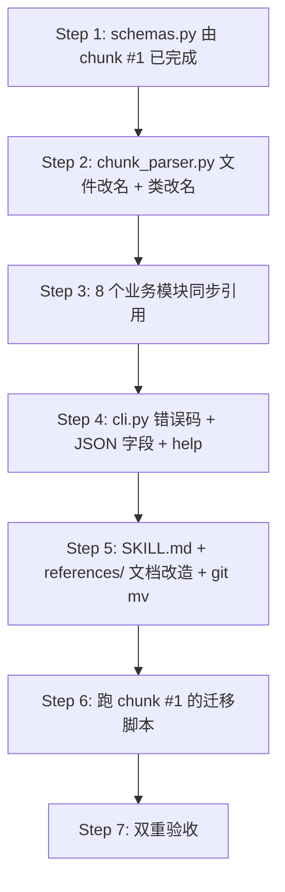

<!-- @ref:prd/skills#prd-skills-rename-block-to-chunk rel:implements -->
<!-- @ref:impl/data-model#impl-data-chunk-rename rel:depends-on -->
<!-- @id:impl-workflow-chunk-rename -->
## Chunk 代码符号与文档术语重命名工作流

落实 PRD `prd-skills-rename-block-to-chunk` 中**代码符号面**与**文档面**的全部重命名要求，以及双重验收脚本的实现。本 chunk 依赖 `impl-data-chunk-rename` 中的 schema 与 `migrations.py` 模块；执行顺序为：先改本 chunk 的代码与文档，再跑 chunk #1 的迁移脚本，最后跑本 chunk 的双重验收。

### 0. 非目标（Out-of-Scope）

- 不动 schema 字段（已由 chunk #1 承担）
- 不动注释语法 `<!-- @id:xxx -->` / `<!-- @ref:... -->`（同 chunk #1 第 0 节）
- 不删除 `references/` 中现有的 `block-parser.md` / `block-system.md` 内容历史，仅做文件名 + 内容术语的同步重命名（`git mv` 保留历史）
- 不改写 `chg-*.yaml` 的 `base_content` / `new_content` 中已记录的历史 markdown（自然语言"block"在用户文档中允许保留）

### 1. 改造范围矩阵

#### 1.1 Python 模块改造表（12 文件 / 381 处命中）

| 文件 | block 命中 | 主要改造点 |
|---|---|---|
| `ait/block_parser.py` → `ait/chunk_parser.py` | 22 | 文件改名 + `Block` 类 → `Chunk`、`ParsedFile.blocks` → `chunks`、模块 docstring |
| `ait/impl_manager.py` | 77 | 全部 `block`/`Block` 标识符；`prd_block_id` → `prd_chunk_id`；ref 注入文案中的 "block" 改 "chunk" |
| `ait/version_manager.py` | 69 | `MergeRecord.merged_blocks` → `merged_chunks`；遍历 `idx.blocks` → `idx.chunks`；变量命名 |
| `ait/prd_manager.py` | 47 | 遍历 `parsed.blocks` → `parsed.chunks`；变量命名；状态消息文案 |
| `ait/merge_engine.py` | 46 | `VersionBlockOp` → `VersionChunkOp`、`new_block` → `new_chunk`、`base.blocks` → `base.chunks`、`_serialize(blocks=...)` |
| `ait/validator.py` | 36 | `validate_block_nonempty` → `validate_chunk_nonempty`、`block_id` → `chunk_id` 字段、错误消息文案 |
| `ait/context_assembler.py` | 27 | 遍历 `parsed.blocks` → `parsed.chunks`；docstring 的 "L1: target block" → "L1: target chunk" |
| `ait/index_manager.py` | 22 | `for block in pf.blocks` → `for chunk in pf.chunks`；方法名 `_load_baseline_blocks` → `_load_baseline_chunks` 等（schema 类已由 chunk #1 重命名） |
| `ait/cli.py` | 18 | 错误码常量、JSON 输出字段、help 文本（详见 §4） |
| `ait/schemas.py` | 11 | （由 chunk #1 完成；本 chunk 仅同步引用） |
| `ait/hash_utils.py` | 5 | 函数 docstring 与变量名 `block_hash` → `chunk_hash` |
| `ait/yaml_io.py` | 1 | 仅一处 docstring 文案 |
| **新增** `ait/migrations.py` | — | 由 chunk #1 引入，本 chunk 不动 |

> 验收硬性指标：改造后 `grep -rn '\bblock\b\|Block\|blocks\|Blocks' skill/ait/ait/ --include='*.py'` 命中数 = 0。允许例外通过行尾注释 `# noqa: chunk-rename` 标记（极少用，仅当 grep 误判时）。

#### 1.2 文档改造表（104 处命中）

| 文件 | 主要改造 |
|---|---|
| `skill/ait/SKILL.md` | 全文 "block" → "chunk"（包括 H2/H3 章节标题、命令示例输出 JSON 字段、术语表） |
| `skill/ait/references/block-parser.md` → `chunk-parser.md` | `git mv` + 全文术语统一 |
| `skill/ait/references/block-system.md` → `chunk-system.md` | `git mv` + 全文术语统一 |
| `skill/ait/references/index-system.md` | 文中提到的 `blocks-index.yaml` / `prd_blocks` 字段名同步 |
| `skill/ait/references/merge-engine.md` | 算法描述中的 "block-level merge" → "chunk-level merge"；`Block` 类引用同步 |
| `skill/ait/references/version-manager.md` | 命令输出 JSON 字段、术语 |
| `skill/ait/references/overview.md` | 概览中的 "block-level version control" → "chunk-level version control" |

#### 1.3 references 内交叉引用同步

`references/` 下文件之间的 markdown 链接需同步：

| 链接形式 | 替换 |
|---|---|
| `[block-parser](block-parser.md)` | `[chunk-parser](chunk-parser.md)` |
| `[block-system](block-system.md)` | `[chunk-system](chunk-system.md)` |
| `see references/block-parser.md` | `see references/chunk-parser.md` |

### 2. 改造执行顺序（避免编译断链）

按依赖图自底向上执行，每一步完成后保证 `python -c "import ait"` 与 `python -m pytest -q` 可通过。



#### Step 2 细节：`block_parser.py` → `chunk_parser.py`

- `git mv skill/ait/ait/block_parser.py skill/ait/ait/chunk_parser.py`
- 类与字段重命名：

| 旧 | 新 |
|---|---|
| `class Block:` | `class Chunk:` |
| `class ParsedFile: blocks: list[Block]` | `class ParsedFile: chunks: list[Chunk]` |
| `def parse_blocks(...)` *（如有外部入口）* | `def parse_chunks(...)` |
| `def serialize_blocks(...)` *（如有外部入口）* | `def serialize_chunks(...)` |
| 模块 docstring 中的 "Block" / "blocks" | "Chunk" / "chunks" |
| `ID_PATTERN` / `REF_PATTERN` regex 字符串 | **不变**（见 chunk #1 §3） |

- 全项目搜替：`from .block_parser import Block, Ref, ParsedFile` → `from .chunk_parser import Chunk, Ref, ParsedFile`

#### Step 3 细节：8 个业务模块同步引用

按调用深度从浅到深处理，避免中间态报错：

1. `validator.py` — 改 `validate_block_nonempty` → `validate_chunk_nonempty`，`ValidationIssue.block_id` 字段 → `chunk_id`
2. `hash_utils.py` — `block_hash` → `chunk_hash`，仅函数与变量
3. `index_manager.py` — schema 已改完，同步遍历 `idx.blocks` → `idx.chunks`，方法 `_load_baseline_blocks` → `_load_baseline_chunks`，`BASELINE_FILE` 常量已由 chunk #1 修改
4. `merge_engine.py` — `VersionBlockOp` → `VersionChunkOp`、`MergeOpResult.blocks` → `chunks`、`_serialize(file_header, blocks)` → `_serialize(file_header, chunks)`
5. `context_assembler.py` — 遍历重命名 + docstring "L1 target block" → "L1 target chunk"
6. `prd_manager.py` — 遍历 + 用户面消息文案；`prd block` → `prd chunk`
7. `impl_manager.py` — 最重的一个；`prd_block_id` → `prd_chunk_id`、`ref_line = f"<!-- @ref:{file}#{prd_chunk_id} rel:implements -->"`、注入逻辑文案
8. `version_manager.py` — `MergeRecord.merged_blocks` → `merged_chunks`，所有 `entry.blocks` 遍历跟进

#### Step 4 细节：`cli.py` 错误码 + JSON + help

| 类型 | 旧 | 新 |
|---|---|---|
| 错误码常量 | `BLOCK_NOT_FOUND` | `CHUNK_NOT_FOUND` |
| 错误码常量 | `BLOCK_NOT_IN_VERSION` | `CHUNK_NOT_IN_VERSION` |
| JSON 字段 | `block_count` | `chunk_count` |
| JSON 字段 | `block_ids` | `chunk_ids` |
| JSON 字段 | `block_id` | `chunk_id` |
| help docstring | `Rebuild baseline blocks-index.yaml ...` | `Rebuild baseline chunks-index.yaml ...` |
| 用户面消息 | `block 'xxx' not found` | `chunk 'xxx' not found` |

#### Step 5 细节：文档与 references

```bash
# 文件名重命名（保留 git 历史）
git mv skill/ait/references/block-parser.md  skill/ait/references/chunk-parser.md
git mv skill/ait/references/block-system.md  skill/ait/references/chunk-system.md
```

文档内全部"block"按以下规则替换：

| 原文 | 替换 |
|---|---|
| Block / block (作为术语) | Chunk / chunk |
| blocks-index.yaml | chunks-index.yaml |
| `prd_blocks` / `impl_blocks` 字段名 | `prd_chunks` / `impl_chunks` |
| 自然语言含义的 "block"（如 "blocking issue"、"code block"） | **保留**（PRD 验收标准明示） |

文档替换完毕后，更新 `SKILL.md` 与 `references/*.md` 之间的内部链接。

### 3. CLI 输出字段兼容性（Hard rename，无 deprecation）

外部使用方需同步改造的契约表。任何依赖 ait CLI JSON 输出的下游工具都必须同步切换字段名：

```jsonc
// Before (v1.1)
{
  "ok": true,
  "data": {
    "block_count": 3,
    "block_ids": ["prd-foo-bar"],
    "block_id": "prd-foo-bar"
  }
}

// After (v1.2)
{
  "ok": true,
  "data": {
    "chunk_count": 3,
    "chunk_ids": ["prd-foo-bar"],
    "chunk_id": "prd-foo-bar"
  }
}
```

错误对象同步：

```jsonc
// Before
{ "ok": false, "error": { "code": "BLOCK_NOT_FOUND", "message": "block 'xxx' not found" } }
// After
{ "ok": false, "error": { "code": "CHUNK_NOT_FOUND", "message": "chunk 'xxx' not found" } }
```

### 4. 自动化验收脚本（Layer 1 + Layer 2）

#### 4.1 Layer 1 — grep 验收

新增 `skill/ait/scripts/verify-no-block-leak.sh`：

```bash
#!/usr/bin/env bash
# verify-no-block-leak.sh — Verify no 'block' identifier leaks after the chunk rename.
# Exit 0 = clean, Exit 1 = leak detected.
set -euo pipefail

ROOT="$(cd "$(dirname "$0")/.." && pwd)"

# Layer 1a: Python source code — must be 0
PY_HITS=$(grep -rIn -E '\bblock\b|\bBlock\b|\bblocks\b|\bBlocks\b' \
            "$ROOT/ait/" \
            --include='*.py' \
            | grep -v '# noqa: chunk-rename' \
            | grep -v -E '"""[^"]*\bblock\b' \
          || true)
PY_COUNT=$(echo -n "$PY_HITS" | grep -c '^' || true)

# Layer 1b: SKILL.md and references/ — must be 0 (term sense)
DOC_HITS=$(grep -rIn -E '\bblock\b|\bBlock\b|\bblocks\b|\bBlocks\b' \
             "$ROOT/SKILL.md" "$ROOT/references/" \
             --include='*.md' \
             | grep -v 'noqa: chunk-rename' \
             | grep -vE 'code block|blocking|unblock' \
           || true)
DOC_COUNT=$(echo -n "$DOC_HITS" | grep -c '^' || true)

if [ "$PY_COUNT" -ne 0 ] || [ "$DOC_COUNT" -ne 0 ]; then
  echo "❌  block-leak detected"
  echo "--- Python ($PY_COUNT) ---"
  echo "$PY_HITS"
  echo "--- Docs ($DOC_COUNT) ---"
  echo "$DOC_HITS"
  exit 1
fi

echo "✅  no block-identifier leak"
```

允许保留的自然语言例外：`code block` / `blocking` / `unblock`（已在 grep -v 中过滤）。

#### 4.2 Layer 2 — 用例回归验收

新增 `skill/ait/scripts/verify-regression.sh`：

```bash
#!/usr/bin/env bash
# verify-regression.sh — End-to-end regression on real project-docs/.
set -euo pipefail

cd "$(git rev-parse --show-toplevel)"

# 0. Sanity: import works
python -c "from ait import schemas, chunk_parser, migrations" || exit 1

# 1. Migrate existing .meta/ data (idempotent)
bin/ait migrate-block-to-chunk

# 2. Reindex from raw markdown
bin/ait reindex

# 3. PRD-side smoke
bin/ait prd list
bin/ait prd show prd-skills-rename-block-to-chunk

# 4. Version-side smoke
bin/ait version status
bin/ait context prd-skills-rename-block-to-chunk --scenario prd-to-impl

echo "✅  regression passed"
```

#### 4.3 验收聚合命令

新增顶层 Makefile target（或独立脚本 `skill/ait/scripts/verify-all.sh`）：

```bash
#!/usr/bin/env bash
set -e
bash skill/ait/scripts/verify-no-block-leak.sh
bash skill/ait/scripts/verify-regression.sh
echo "✅  all verifications passed"
```

### 5. 风险与回滚

| 风险 | 概率 | 缓解 |
|---|---|---|
| 12 个 .py 文件同步替换遗漏一处导致 `ImportError` | 中 | Step 2~5 完成后立即 `python -c "import ait"` + `pytest -q` |
| 用户已有的 `chg-*.yaml` 含历史 `base_content` 中字面 `blocks:` 字串被误改 | 低 | 迁移脚本（chunk #1）已显式跳过 `base_content` / `new_content` 字段 |
| 文档"block"自然语言遗漏未保留（如 `code block`） | 低 | grep 验收脚本带白名单过滤（`code block`/`blocking`/`unblock`） |
| 验收脚本本身有 bug 导致漏报 | 低 | 在 v1.2 commit 前先在 v1.1 状态下运行一次：必须报错（证明能检出） |
| 外部使用方依赖旧 JSON 字段 | 中 | hard-break 已在 PRD 中说明；本 chunk §3 提供清晰对照表供下游同步 |

回滚预案：本 chunk 不提供反向迁移；以 `git reset --hard <pre-rename-commit>` + 删除 `.meta/.migrated-chunk-v1` 文件为标准回滚动作。

### 6. 验收要点

#### 必过项

- `bash skill/ait/scripts/verify-no-block-leak.sh` 退出码 0
- `bash skill/ait/scripts/verify-regression.sh` 退出码 0
- `git ls-files | grep -E '(^|/)block' | wc -l` = 0（无 `block_parser.py` / `block-parser.md` / `block-system.md` 残留）
- `find skill/ait/references -name 'chunk-*.md' | wc -l` ≥ 2（重命名落地）
- `python -m pytest skill/ait/tests/ -q` 全部通过（如有现有测试套件；若无则跳过）

#### 抽样人工核查

- `bin/ait reindex` 输出 JSON 中字段为 `chunk_count` / `chunk_ids`
- `bin/ait prd show <id>` 错误时返回 `CHUNK_NOT_FOUND`（用不存在的 id 触发）
- `cat .meta/chunks-index.yaml` 顶层字段为 `chunks:`
- `cat skill/ait/SKILL.md | grep -i 'chunk' | wc -l` 显著大于 0；`grep -i 'block' | wc -l` 仅命中自然语言例外

<!-- @ref:prd/skills#prd-skills-rename-block-to-chunk rel:implements -->
